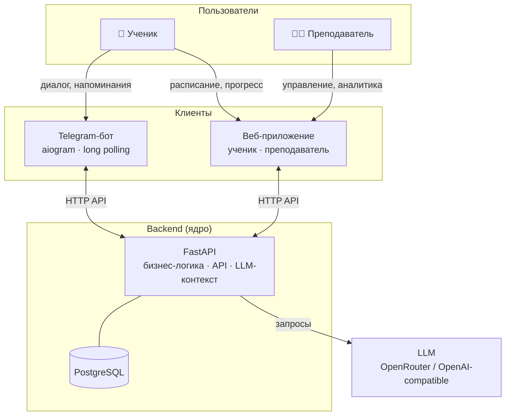

# Система сопровождения учебного процесса

Telegram-бот + веб-приложение для поддержки учеников 7–9 классов и преподавателя математики.

> Учебный проект: отработка AI-driven / Spec-driven development на реальном продуктовом сценарии.

## О проекте

Ученик занимается индивидуально — преподаватель хочет видеть факты о занятиях и домашних работах, а не договорённости «на словах». Система обеспечивает персональный диалог через Telegram (LLM-ассистент с контекстом), фиксацию расписания и статусов ДЗ, напоминания. В перспективе — единый веб-интерфейс для ученика и преподавателя через общий backend.

## Архитектура



Логика и данные — только в backend. Бот и веб — тонкие клиенты.

## Статус

| # | Итерация | Цель | Статус |
|---|----------|------|--------|
| 1 | Базовый бот с LLM | Рабочий бот с диалогом через LLM | ✅ Done |
| 2 | Backend Core | FastAPI + PostgreSQL + доменная модель | ✅ Done |
| 3 | Персонализированный диалог | Бот как тонкий клиент; контекст из БД в LLM | 🚧 In Progress — частично |
| 4 | Расписание и домашние задания | Занятия, ДЗ, напоминания через backend | 📋 Planned |
| 5 | Веб-интерфейс | Фронтенд для ученика и преподавателя | 📋 Planned |
| 6 | Прогресс и аналитика | Агрегация результатов, отчёты | 📋 Planned |

Детальный ход работ — [docs/tasks/tasklist-backend.md](docs/tasks/tasklist-backend.md). По **итерации 3** (персонализированный диалог) оставшиеся пункты ведутся в [tasklist бота](docs/tasks/tasklist-bot-iteration-3-personalized-dialog.md): сейчас есть тонкий клиент, сохранение диалога и базовое обогащение промпта из БД; полнота сценариев и критерии из [docs/plan.md](docs/plan.md) — ещё не закрыты.

## Документация

- [Идея продукта](docs/idea.md)
- [Архитектурное видение](docs/vision.md)
- [Модель данных](docs/data-model.md) — логическая модель, физическая схема (PostgreSQL-типы, индексы, FK-каскады)
- [Интеграции](docs/integrations.md)
- [Практическая справка: работа с БД](docs/tech/db-guide.md) — миграции, репозитории, сессия, SQL-сниппеты
- [HTTP API: контракты](docs/tech/api-contracts.md)
- [Конвенции HTTP API](docs/api-conventions.md)
- [Дорожная карта](docs/plan.md)
- [Задачи backend](docs/tasks/tasklist-backend.md)
- [Задачи: слой данных](docs/tasks/tasklist-database.md)

## Быстрый старт (бот)

Бот вызывает только **HTTP API backend** (`POST /v1/dialogue/message`). Ключ OpenRouter и модель нужны процессу **backend**, не боту.

```bash
cp .env.example .env   # TELEGRAM_BOT_TOKEN, BACKEND_URL; для backend — DATABASE_URL, OPENROUTER_API_KEY
make install           # uv sync --all-packages (по умолчанию ставится группа dev: pytest, ruff и др.)
make run               # запустить бота (сначала поднимите backend)
```

Переменные окружения описаны в [.env.example](.env.example).

### End-to-end: бот → backend → LLM (ручной smoke)

1. Заполните `.env`: `DATABASE_URL`, `OPENROUTER_API_KEY`, `TELEGRAM_BOT_TOKEN`, `BACKEND_URL=http://127.0.0.1:8000`.
2. Поднимите БД и схему: `make backend-db-up`, затем `make backend-db-migrate` (или SQLite — см. раздел Backend ниже).
3. Зарегистрируйте ученика в backend с вашим `telegram_id` (через `POST /v1/users` или `curl` из [docs/integrations.md](docs/integrations.md)) — иначе диалог вернёт `user_not_found`.
4. Терминал 1: `make backend-run` — дождитесь готовности, проверьте `GET http://127.0.0.1:8000/health`.
5. Терминал 2: `make run` — long polling бота.
6. В Telegram: `/start`, затем текстовый вопрос — ответ идёт из backend (история диалога в БД).

Краткая подсказка по шагам: `make smoke-integration`.

## Backend (FastAPI)

По умолчанию сервер слушает **http://127.0.0.1:8000**.  
`GET /health` — проверка готовности: `{"status":"ok"}` или `{"status":"degraded","database":"unavailable"}` (503) при недоступной БД.

### С PostgreSQL

```bash
make install              # зависимости workspace (бот + backend)
make backend-db-up        # PostgreSQL в Docker (localhost:5432)
# В .env задать DATABASE_URL=postgresql+asyncpg://... (см. .env.example)
make backend-db-migrate   # Alembic: применить миграции
make backend-run          # http://127.0.0.1:8000
```

### Без PostgreSQL (SQLite, только для локальной проверки)

```bash
# В .env:
# DATABASE_URL=sqlite+aiosqlite:///./local.db
# TTLG_ALLOW_SQLITE_TEST=1
make backend-run
```

Схема создаётся автоматически при старте. Миграции Alembic при SQLite не применяются.

### Тесты и линт

```bash
make backend-test   # pytest backend/tests -v (SQLite in-memory, LLM замокан)
make bot-test       # pytest tests/ — интеграция BackendClient с backend
make lint           # ruff check (src, backend, тесты, Alembic)
make format         # ruff format
make check          # lint + backend-test + bot-test (удобно перед PR)
```

### OpenAPI

Swagger UI: **http://127.0.0.1:8000/docs** при запущенном backend. Статическая схема: `make openapi-export` → [docs/openapi.json](docs/openapi.json).
