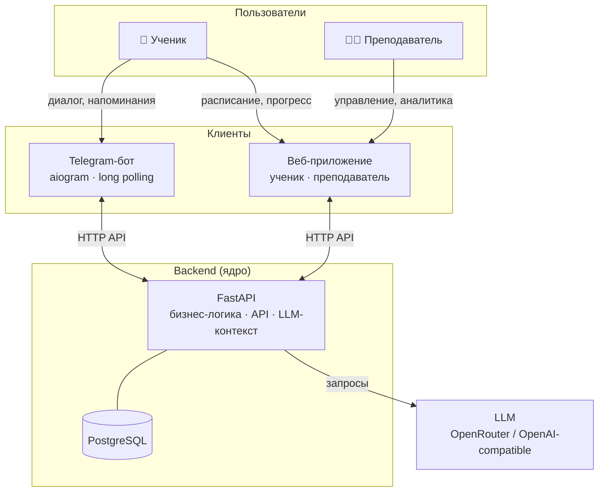

# Система сопровождения учебного процесса

Telegram-бот + веб-приложение для поддержки учеников 7–9 классов и преподавателя математики.

> Учебный проект: отработка AI-driven / Spec-driven development на реальном продуктовом сценарии.

## О проекте

Ученик занимается индивидуально — преподаватель хочет видеть факты о занятиях и домашних работах, а не договорённости «на словах». Система обеспечивает персональный диалог через Telegram (LLM-ассистент с контекстом), фиксацию расписания и статусов ДЗ, напоминания. В перспективе — единый веб-интерфейс для ученика и преподавателя через общий backend.

## Архитектура

Логика и данные — только в backend. Бот и веб — тонкие клиенты.

## Статус

| # | Итерация | Цель | Статус |
|---|----------|------|--------|
| 1 | Базовый бот с LLM | Рабочий бот с диалогом через LLM | 📋 Planned |
| 2 | Backend Core | FastAPI + PostgreSQL + доменная модель | 📋 Planned |
| 3 | Персонализированный диалог | Бот как тонкий клиент; контекст из БД в LLM | 📋 Planned |
| 4 | Расписание и домашние задания | Занятия, ДЗ, напоминания через backend | 📋 Planned |
| 5 | Веб-интерфейс | Фронтенд для ученика и преподавателя | 📋 Planned |
| 6 | Прогресс и аналитика | Агрегация результатов, отчёты | 📋 Planned |

## Документация

- [Идея продукта](docs/idea.md)
- [Архитектурное видение](docs/vision.md)
- [Модель данных](docs/data-model.md)
- [Интеграции](docs/integrations.md)
- [План](docs/plan.md)
- [Задачи](docs/tasks/)

## Быстрый старт

Инструкция появится после реализации итерации 1. До этого: `uv sync`, заполнить `.env` по `.env.example`, `make run`.
