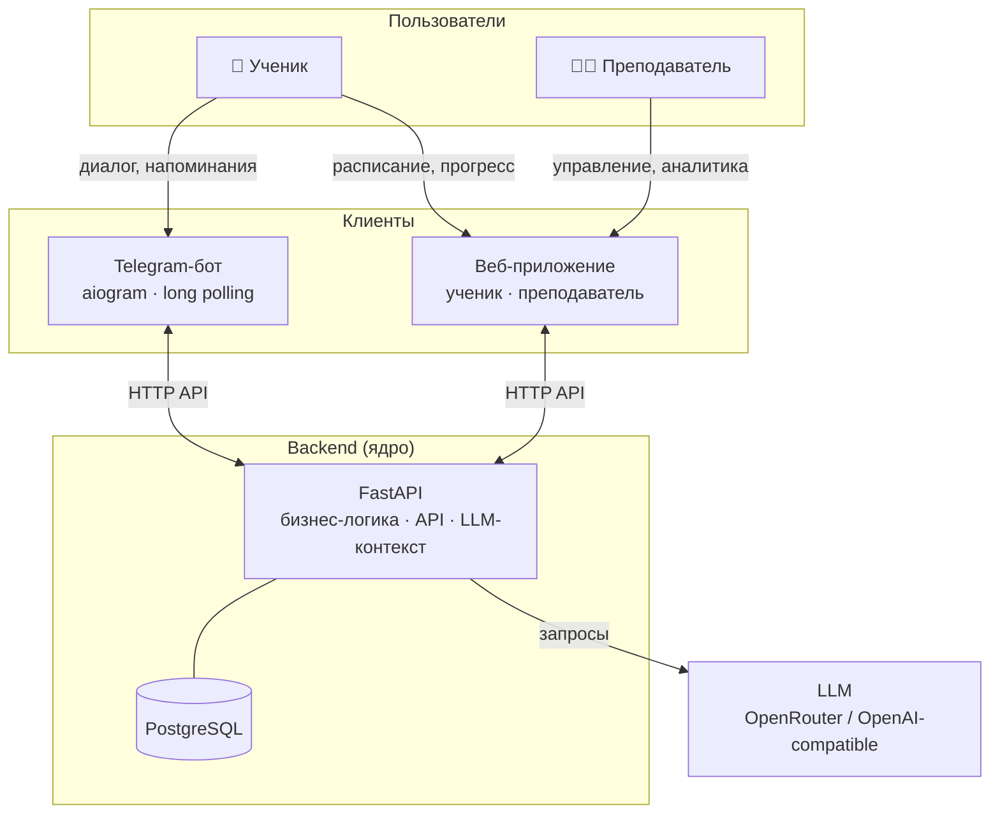

# Система сопровождения учебного процесса

Telegram-бот + веб-приложение для поддержки учеников 7–9 классов и преподавателя математики.

> Учебный проект: отработка AI-driven / Spec-driven development на реальном продуктовом сценарии.

## О проекте

Ученик занимается индивидуально — преподаватель хочет видеть факты о занятиях и домашних работах, а не договорённости «на словах». Система обеспечивает персональный диалог через Telegram (LLM-ассистент с контекстом), фиксацию расписания и статусов ДЗ, напоминания. В перспективе — единый веб-интерфейс для ученика и преподавателя через общий backend.

## Архитектура



Логика и данные — только в backend. Бот и веб — тонкие клиенты.

## Статус

| # | Итерация | Цель | Статус |
|---|----------|------|--------|
| 1 | Базовый бот с LLM | Рабочий бот с диалогом через LLM | 📋 Planned |
| 2 | Backend Core | FastAPI + PostgreSQL + доменная модель | 🚧 In Progress |
| 3 | Персонализированный диалог | Бот как тонкий клиент; контекст из БД в LLM | 📋 Planned |
| 4 | Расписание и домашние задания | Занятия, ДЗ, напоминания через backend | 📋 Planned |
| 5 | Веб-интерфейс | Фронтенд для ученика и преподавателя | 📋 Planned |
| 6 | Прогресс и аналитика | Агрегация результатов, отчёты | 📋 Planned |

Детальный ход работ — [docs/tasks/tasklist-backend.md](docs/tasks/tasklist-backend.md).

## Документация

- [Идея продукта](docs/idea.md)
- [Архитектурное видение](docs/vision.md)
- [Модель данных](docs/data-model.md)
- [Интеграции](docs/integrations.md)
- [HTTP API: контракты](docs/tech/api-contracts.md)
- [Конвенции HTTP API](docs/api-conventions.md)
- [Дорожная карта](docs/plan.md)
- [Задачи backend](docs/tasks/tasklist-backend.md)

## Быстрый старт (бот)

```bash
cp .env.example .env   # заполнить TELEGRAM_BOT_TOKEN, OPENROUTER_API_KEY, LLM_MODEL
make install           # uv sync
make run               # запустить бота
```

Переменные окружения описаны в [.env.example](.env.example).

> Бот пока обращается к LLM напрямую (Итерация 1). В Итерации 3 он станет тонким клиентом backend API.

## Backend (FastAPI)

По умолчанию сервер слушает **http://127.0.0.1:8000**.  
`GET /health` — проверка готовности: `{"status":"ok"}` или `{"status":"degraded","database":"unavailable"}` (503) при недоступной БД.

### С PostgreSQL

```bash
make install              # зависимости workspace (бот + backend)
make backend-db-up        # PostgreSQL в Docker (localhost:5432)
# В .env задать DATABASE_URL=postgresql+asyncpg://... (см. .env.example)
make backend-db-migrate   # Alembic: применить миграции
make backend-run          # http://127.0.0.1:8000
```

### Без PostgreSQL (SQLite, только для локальной проверки)

```bash
# В .env:
# DATABASE_URL=sqlite+aiosqlite:///./local.db
# TTLG_ALLOW_SQLITE_TEST=1
make backend-run
```

Схема создаётся автоматически при старте. Миграции Alembic при SQLite не применяются.

### Тесты

```bash
make backend-test   # pytest backend/tests -v (SQLite in-memory, LLM замокан)
```

### OpenAPI

Swagger UI доступен по адресу **http://127.0.0.1:8000/docs** при запущенном сервере.
