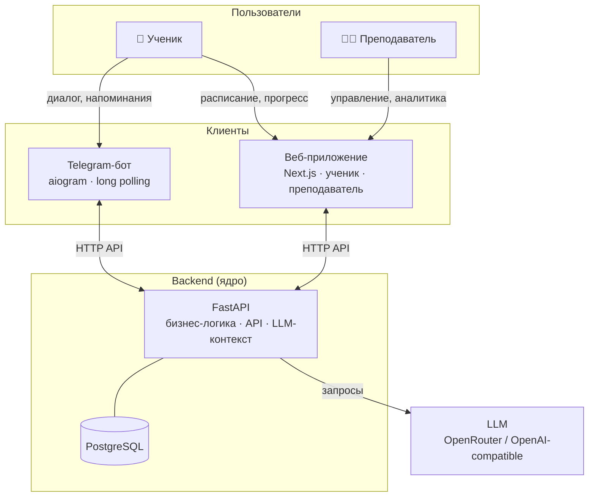

# Система сопровождения учебного процесса (TTLG)

Telegram-бот + веб-приложение для поддержки учеников 7–9 классов и преподавателя математики.


## О проекте

Ученик занимается индивидуально — преподаватель хочет видеть факты о занятиях и домашних работах, а не договорённости «на словах». Система обеспечивает персональный диалог через Telegram (LLM-ассистент с контекстом), фиксацию расписания и статусов ДЗ, напоминания. **Веб-клиент** (Next.js) для ученика и преподавателя работает через тот же backend API.

## Архитектура



Логика и данные — только в backend. Бот и веб — тонкие клиенты.

**Подробно:** [docs/architecture.md](docs/architecture.md) (компоненты, sequence-диаграммы, ссылки).  
**Код Telegram-бота** — пакет `src/ttlg_bot/`; каталог `bot/` в корне пустой (историческое имя, не путать с пакетом).

## Статус

Актуальная дорожная карта и пояснения — **[docs/plan.md](docs/plan.md)**.

| # | Итерация | Цель | Статус |
|---|----------|------|--------|
| 1 | Базовый бот с LLM | Рабочий бот с диалогом через LLM | ✅ Done |
| 2 | Backend Core | FastAPI + PostgreSQL + доменная модель | ✅ Done |
| 3 | Персонализированный диалог | Бот как тонкий клиент; контекст из БД в LLM | ✅ Done |
| 4 | Расписание и домашние задания | Занятия, ДЗ, напоминания через backend | ✅ Done (MVP) |
| 5 | Веб-интерфейс | Фронтенд для ученика и преподавателя | ✅ Done |
| 6 | Прогресс и аналитика | Агрегация, отчёты, обогащение LLM-контекста | 🚧 Частично |

Детализация по областям: [backend](docs/tasks/tasklist-backend.md), [frontend](docs/tasks/tasklist-frontend.md), [слой данных](docs/tasks/tasklist-database.md) (✅ Done). **Итерация 3:** бот — тонкий клиент (`POST /v1/dialogue/message`), история и контекст в PostgreSQL — [tasklist бота](docs/tasks/tasklist-bot-iteration-3-personalized-dialog.md).

## Документация

- [Архитектура (технический обзор)](docs/architecture.md) — схемы, границы, точки входа
- [Онбординг](docs/onboarding.md) — пошаговый запуск и проверки
- [Участие в разработке](docs/contributing.md)
- [Идея продукта](docs/idea.md)
- [Архитектурное видение](docs/vision.md)
- [Модель данных](docs/data-model.md) — логическая модель, физическая схема (PostgreSQL-типы, индексы, FK-каскады)
- [Интеграции](docs/integrations.md)
- [Практическая справка: работа с БД](docs/tech/db-guide.md) — миграции, репозитории, сессия, SQL-сниппеты
- [HTTP API: контракты](docs/tech/api-contracts.md)
- [Конвенции HTTP API](docs/api-conventions.md)
- [Дорожная карта](docs/plan.md)
- [Запуск в Docker (полный стек)](docs/how-to-docker.md)
- [Задачи DevOps](docs/tasks/tasklist-devops.md)
- [Задачи backend](docs/tasks/tasklist-backend.md)
- [Задачи frontend (веб)](docs/tasks/tasklist-frontend.md)
- [Требования к UI (спецификация экранов)](docs/spec/frontend-requirements.md)
- [Задачи: слой данных](docs/tasks/tasklist-database.md)

## Системные требования

Перед первым запуском убедитесь, что установлено:

| Инструмент | Минимальная версия | Установка |
|------------|--------------------|-----------|
| **Python** | 3.12 | [python.org](https://www.python.org/downloads/) |
| **uv** | 0.5+ | `curl -LsSf https://astral.sh/uv/install.sh \| sh` (или [docs](https://docs.astral.sh/uv/getting-started/installation/)) |
| **Docker** | 24+ | [docs.docker.com](https://docs.docker.com/get-docker/) |
| **Node.js** | 20 LTS | [nodejs.org](https://nodejs.org/) |
| **pnpm** | 9+ | `npm install -g pnpm` (или [pnpm.io](https://pnpm.io/installation)) |

> **Windows / PowerShell:**  
> - Вызывайте **`make`**, а не `makefile` — второе слово в PowerShell воспринимается как имя программы; файл сценария называется `Makefile`, утилита — **GNU Make** (`make`), её нужно [установить и добавить в PATH](https://community.chocolatey.org/packages/make) или использовать среду, где `make` уже есть (часто **Git Bash**).  
> - Список целей без установленного `make`: из корня репозитория **`.\make-help.cmd`** или `python scripts/make_help.py`.  
> - `make stack-health` вызывает `python scripts/stack_health.py` (без curl). Прочие рецепты, где нужен POSIX-шелл, удобнее запускать из Git Bash / WSL.

## Переменные окружения

| Файл | Процессы | Назначение |
|------|----------|------------|
| [`.env.example`](.env.example) → `.env` в **корне** | `make run`, `make backend-run`, `make backend-test`, Alembic, **Docker Compose** | `DATABASE_URL`, `SECRET_KEY`, `AUTH_SECRET` (как у `SECRET_KEY` для JWT во frontend), `OPENROUTER_*`, `TELEGRAM_*`, `BACKEND_URL`, `DATABASE_TEST_URL` и др. |
| [`frontend/.env.local.example`](frontend/.env.local.example) → `frontend/.env.local` | Next.js | `NEXT_PUBLIC_API_URL`, `AUTH_SECRET` и публичные URL для клиента |

Копирование: `cp .env.example .env` и `cp frontend/.env.local.example frontend/.env.local`.

## Docker / полный стек

Поднять **PostgreSQL + backend + бот + frontend** в контейнерах: корневой [`docker-compose.yml`](docker-compose.yml), Dockerfile в [`devops/`](devops/README.md).

```bash
cp .env.example .env   # в т.ч. AUTH_SECRET = тот же секрет, что SECRET_KEY
make stack-up          # сборка образов и запуск
make stack-migrate     # Alembic в одноразовом контейнере backend
```

Справка по переменным, сетям и troubleshooting: **[docs/how-to-docker.md](docs/how-to-docker.md)**. Список задач DevOps: [docs/tasks/tasklist-devops.md](docs/tasks/tasklist-devops.md).

Ручной **продуктовый смоук** на полном стеке в Docker зафиксирован **2026-04-27** — таблица проверок: [docs/how-to-docker.md — «Ручная проверка зафиксировано»](docs/how-to-docker.md#ручная-проверка-зафиксировано).

## Быстрый старт (бот)

Бот вызывает только **HTTP API backend** (`POST /v1/dialogue/message`). Ключ OpenRouter и модель нужны процессу **backend**, не боту.

```bash
cp .env.example .env   # TELEGRAM_BOT_TOKEN, BACKEND_URL; для backend — DATABASE_URL, OPENROUTER_API_KEY
make install           # uv sync --all-packages (по умолчанию ставится группа dev: pytest, ruff и др.)
make run               # запустить бота (сначала поднимите backend)
```

Переменные окружения описаны в [.env.example](.env.example).

### End-to-end: бот → backend → LLM (ручной smoke)

1. Заполните `.env`: `DATABASE_URL`, `OPENROUTER_API_KEY`, `TELEGRAM_BOT_TOKEN`, `BACKEND_URL=http://127.0.0.1:8000`.
2. Поднимите БД, примените миграции и загрузите тестовые данные:
   ```bash
   make backend-db-up
   make backend-db-migrate
   make backend-db-seed  # создаёт тестового ученика (telegram_id=111111111)
   ```
3. Зарегистрируйте себя с реальным `telegram_id` — иначе бот ответит «Профиль не найден». Узнать `telegram_id` — через [@userinfobot](https://t.me/userinfobot). Примеры команд — в [docs/integrations.md](docs/integrations.md#регистрация-пользователя-перед-smoke-тестом).
4. Терминал 1: `make backend-run` — дождитесь готовности, проверьте `GET http://127.0.0.1:8000/health`.
5. Терминал 2: `make run` — long polling бота.
6. В Telegram: `/start`, затем текстовый вопрос — ответ идёт из backend (история диалога в PostgreSQL).

Краткая подсказка по шагам: `make smoke-integration`.

## Backend (FastAPI)

По умолчанию сервер слушает **http://127.0.0.1:8000**.  
`GET /health` — проверка готовности: `{"status":"ok"}` или `{"status":"degraded","database":"unavailable"}` (503) при недоступной БД.

### С PostgreSQL

```bash
make install              # зависимости workspace (бот + backend)
make backend-db-up        # PostgreSQL в Docker (localhost:5432)
# В .env задать DATABASE_URL=postgresql+asyncpg://... (см. .env.example)
make backend-db-migrate   # Alembic: применить миграции
make backend-run          # http://127.0.0.1:8000
```

### Без PostgreSQL (SQLite, только для быстрой локальной проверки без Docker)

```bash
# В .env:
# DATABASE_URL=sqlite+aiosqlite:///./local.db
# TTLG_ALLOW_SQLITE_TEST=1   ← устарело; оставлено для совместимости, может быть удалено
make backend-run
```

Схема создаётся автоматически при старте. Миграции Alembic при SQLite не применяются. **Не использовать для `make backend-test`** — backend-тесты работают только с PostgreSQL (`ttlg_test`).

### Тесты и линт

```bash
make backend-db-test-create  # создать базу ttlg_test (однократно, требует запущенного docker)
                             # DATABASE_TEST_URL должен совпадать (см. .env.example)
make backend-test            # pytest backend/tests -v (PostgreSQL ttlg_test, LLM замокан)
make bot-test                # pytest tests/ — интеграция BackendClient (SQLite, без Docker)
make lint                    # ruff check (src, backend, тесты, Alembic)
make format                  # ruff format
make check                   # lint + backend-test + bot-test + frontend-lint (без frontend-test; см. contributing)
```

`make frontend-test` при работе с фронтендом запускайте вручную (в `check` не входит).

## Frontend (Next.js)

Каталог: `frontend/`. Менеджер пакетов: **pnpm** (workspace в корне репозитория).

```bash
pnpm install                 # зависимости workspace (в т.ч. frontend)
cp frontend/.env.local.example frontend/.env.local   # задайте NEXT_PUBLIC_API_URL, AUTH_SECRET
make frontend-dev            # dev-сервер (см. вывод в терминале, обычно http://127.0.0.1:3000)
make frontend-build          # production-сборка
make frontend-lint           # ESLint
make frontend-test           # Vitest (unit + integration, см. frontend/vitest.config.ts)
```

Для работы UI нужен запущенный backend и корректный `BACKEND_URL` / авторизация — см. [docs/tech/api-contracts.md](docs/tech/api-contracts.md) и `.env.example`.

### OpenAPI

Swagger UI: **http://127.0.0.1:8000/docs** при запущенном backend. Статическая схема: `make openapi-export` → [docs/openapi.json](docs/openapi.json).
