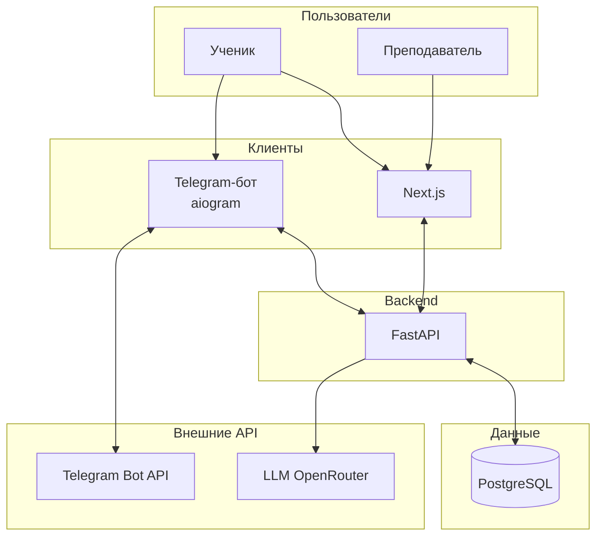
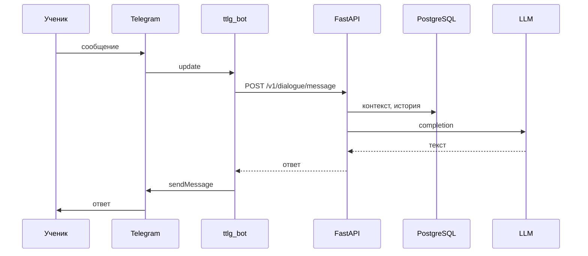
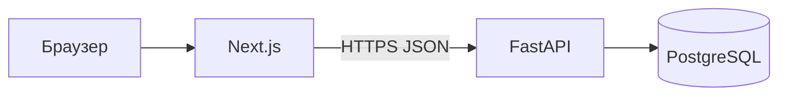

# Архитектура системы (технический обзор)

Краткая схема устройства репозитория и взаимодействий компонентов. Продуктовое видение и принципы — в [vision.md](vision.md); детали данных — в [data-model.md](data-model.md); HTTP — в [tech/api-contracts.md](tech/api-contracts.md).

---

## Границы и роли

| Компонент | Расположение в репо | Роль |
|-----------|---------------------|------|
| **Telegram-бот** | `src/ttlg_bot/` | Тонкий клиент: long polling, вызовы backend API |
| **Backend (API)** | `backend/src/ttlg_backend/` | Бизнес-логика, авторизация, LLM, доступ к БД |
| **Веб-клиент** | `frontend/` | Next.js: ученик и преподаватель через тот же API |
| **PostgreSQL** | вне репо (Docker `docker-compose.yml`) | Единое хранилище состояния |

> Каталог `bot/` в корне репозитория пустой; код бота живёт в **`src/ttlg_bot/`**.

---

## Высокоуровневая схема

---

## Потоки запросов

### Диалог ученика в Telegram

### Веб-клиент

Браузер обращается к Next.js; серверные и клиентские запросы к backend идут на URL из `NEXT_PUBLIC_API_URL` / сессии (см. [api-contracts.md](tech/api-contracts.md). CORS для dev — `CORS_ORIGINS` в `.env`.

---

## Слой данных и миграции

- ORM: SQLAlchemy 2, async; схема описана в [data-model.md](data-model.md).
- Миграции: Alembic (`backend/alembic/`), ручной рабочий цикл — [tech/db-guide.md](tech/db-guide.md).

---

## Соглашения по границам

- **Бизнес-логика** — только в backend; бот и фронт не дублируют правила предметной области.
- **LLM** вызывается из backend; бот не хранит ключи провайдера.
- **Контракт API** — OpenAPI / [openapi.json](openapi.json), обновление: `make openapi-export`.

---

## ADR и спецификации

- [adr/](adr/) — решения по стеку и подходам.
- [api-conventions.md](api-conventions.md) — стиль HTTP API.
- [spec/frontend-requirements.md](spec/frontend-requirements.md) — экраны веб-клиента.

---

## Связь с обзором в README

Корневой [README.md](../README.md) содержит компактную диаграмму; этот документ — расширенное описание и точки входа в детальные материалы.
