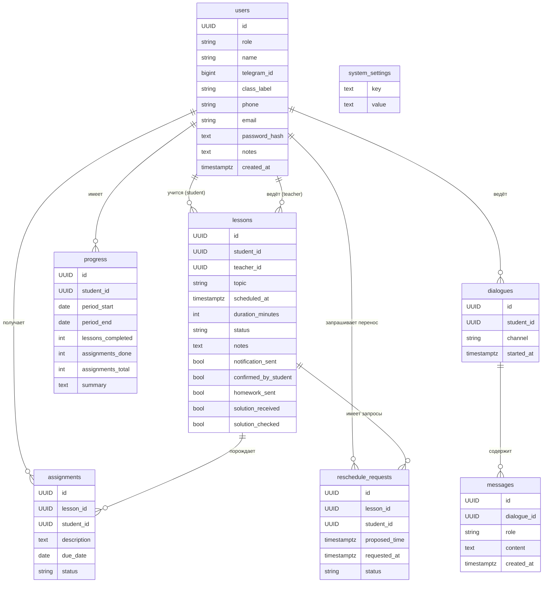

# Модель данных

Документ фиксирует логическую и физическую схему данных системы сопровождения учебного процесса. Источник правды по типам и constraints — [`backend/src/ttlg_backend/storage/models.py`](../backend/src/ttlg_backend/storage/models.py).

---

## Логическая модель

### User (Пользователь)

Единая запись для всех ролей в системе.

| Поле | Тип | Nullable | Описание |
|------|-----|----------|---------|
| id | UUID | NOT NULL | Первичный ключ |
| role | enum (`user_role`) | NOT NULL | `student` · `teacher` |
| name | VARCHAR(255) | NOT NULL | Имя пользователя |
| telegram_id | BIGINT | NULL, UNIQUE | Привязка к Telegram-аккаунту |
| class_label | VARCHAR(32) | NULL | Номер / литера класса (например `10А`); обычно у ученика |
| phone | VARCHAR(32) | NULL | Телефон; обычно у ученика |
| email | VARCHAR(255) | NULL | Email; обычно у ученика (уникальность в MVP не enforced) |
| password_hash | TEXT | NULL | Bcrypt-хеш пароля (веб-логин преподавателя/ученика); `NULL` для пользователей только из Telegram |
| notes | TEXT | NULL | Заметки / цель обучения (профиль ученика; форма преподавателя) |
| created_at | TIMESTAMPTZ | NOT NULL | Дата регистрации; `DEFAULT now()` |

---

### Lesson (Занятие)

Конкретная учебная сессия между преподавателем и учеником.

| Поле | Тип | Nullable | Описание |
|------|-----|----------|---------|
| id | UUID | NOT NULL | Первичный ключ |
| student_id | UUID → users.id | NOT NULL | Ученик; `ON DELETE CASCADE` |
| teacher_id | UUID → users.id | NOT NULL | Преподаватель; `ON DELETE CASCADE` |
| topic | VARCHAR(512) | NOT NULL | Тема занятия |
| scheduled_at | TIMESTAMPTZ | NOT NULL | Запланированное время |
| duration_minutes | SMALLINT | NOT NULL | Длительность занятия в минутах; `DEFAULT 60`, `> 0` |
| status | enum (`lesson_status`) | NOT NULL | `scheduled` · `completed` · `cancelled` |
| notes | TEXT | NULL | Заметки по итогам занятия |
| notification_sent | BOOLEAN | NOT NULL | Уведомление о занятии отправлено; `DEFAULT false` |
| confirmed_by_student | BOOLEAN | NOT NULL | Ученик подтвердил занятие; `DEFAULT false` |
| homework_sent | BOOLEAN | NOT NULL | ДЗ отправлено; `DEFAULT false` |
| solution_received | BOOLEAN | NOT NULL | Решение получено; `DEFAULT false` |
| solution_checked | BOOLEAN | NOT NULL | Решение проверено; `DEFAULT false` |

---

### RescheduleRequest (Запрос на перенос занятия)

Запрос ученика перенести занятие на другое время. Обрабатывает преподаватель.

| Поле | Тип | Nullable | Описание |
|------|-----|----------|---------|
| id | UUID | NOT NULL | Первичный ключ |
| lesson_id | UUID → lessons.id | NOT NULL | Занятие; `ON DELETE CASCADE` |
| student_id | UUID → users.id | NOT NULL | Ученик; `ON DELETE CASCADE` |
| proposed_time | TIMESTAMPTZ | NOT NULL | Предлагаемое время |
| requested_at | TIMESTAMPTZ | NOT NULL | Время запроса; `DEFAULT now()` |
| status | TEXT | NOT NULL | `pending` · `accepted` · `rejected` (CHECK в БД) |

Индексы: `(lesson_id)`, `(student_id)`.

---

### SystemSetting (Настройки системы)

Key-value хранилище настроек веб-интерфейса (имя преподавателя, длительность по умолчанию, интервалы напоминаний).

| Поле | Тип | Nullable | Описание |
|------|-----|----------|---------|
| key | TEXT | NOT NULL | Первичный ключ (имя параметра) |
| value | TEXT | NOT NULL | Значение (строка; числа — как текст) |

---

### Assignment (Домашнее задание)

Задание, выданное по итогам занятия или отдельно.

| Поле | Тип | Nullable | Описание |
|------|-----|----------|---------|
| id | UUID | NOT NULL | Первичный ключ |
| lesson_id | UUID → lessons.id | NULL | Привязка к занятию; `ON DELETE SET NULL` |
| student_id | UUID → users.id | NOT NULL | Кому выдано; `ON DELETE CASCADE` |
| description | TEXT | NOT NULL | Формулировка задания |
| due_date | DATE | NOT NULL | Срок сдачи |
| status | enum (`assignment_status`) | NOT NULL | `pending` · `submitted` · `overdue` |

> `status = overdue` не вычисляется автоматически — обновляется вручную или фоновым процессом (задача приложения, не PostgreSQL). Семантика: `pending` → не сдано в срок, не просрочено; `overdue` — просрочено.

---

### Progress (Прогресс)

Агрегированная оценка выполнения ДЗ и посещаемости ученика за период. Пересчёт **вручную** через API (преподаватель). Автоматический триггер — отложен.

| Поле | Тип | Nullable | Описание |
|------|-----|----------|---------|
| id | UUID | NOT NULL | Первичный ключ |
| student_id | UUID → users.id | NOT NULL | Ученик; `ON DELETE CASCADE` |
| period_start | DATE | NOT NULL | Начало периода |
| period_end | DATE | NOT NULL | Конец периода |
| lessons_completed | INT | NOT NULL | Занятий пройдено; `DEFAULT 0` |
| assignments_done | INT | NOT NULL | ДЗ выполнено; `DEFAULT 0` |
| assignments_total | INT | NOT NULL | ДЗ всего за период; `DEFAULT 0` |
| summary | TEXT | NULL | Комментарий преподавателя |

> Денормализованный агрегат — осознанное решение для MVP. Риск расхождения с фактическими данными — принят; устраняется при автоматическом пересчёте (будущая итерация).

---

### Dialogue (Диалог)

История переписки ученика с LLM-ассистентом.

| Поле | Тип | Nullable | Описание |
|------|-----|----------|---------|
| id | UUID | NOT NULL | Первичный ключ |
| student_id | UUID → users.id | NOT NULL | Ученик; `ON DELETE CASCADE` |
| channel | enum (`dialogue_channel`) | NOT NULL | `telegram` · `web` |
| started_at | TIMESTAMPTZ | NOT NULL | Начало диалога; `DEFAULT now()` |

---

### Message (Сообщение в диалоге)

Отдельное сообщение внутри диалога.

| Поле | Тип | Nullable | Описание |
|------|-----|----------|---------|
| id | UUID | NOT NULL | Первичный ключ |
| dialogue_id | UUID → dialogues.id | NOT NULL | Диалог; `ON DELETE CASCADE` |
| role | enum (`message_role`) | NOT NULL | `user` · `assistant` |
| content | TEXT | NOT NULL | Текст сообщения |
| created_at | TIMESTAMPTZ | NOT NULL | Время отправки; `DEFAULT now()` |

---

## Логическая ER-диаграмма



---

## Физическая схема

### PostgreSQL-типы колонок

```
users
  id            UUID          NOT NULL  PRIMARY KEY
  role          user_role     NOT NULL
  name          VARCHAR(255)  NOT NULL
  telegram_id   BIGINT        NULL      UNIQUE
  class_label   VARCHAR(32)   NULL
  phone         VARCHAR(32)   NULL
  email         VARCHAR(255)  NULL
  password_hash TEXT          NULL
  notes         TEXT          NULL
  created_at    TIMESTAMPTZ   NOT NULL  DEFAULT now()

lessons
  id                 UUID          NOT NULL  PRIMARY KEY
  student_id         UUID          NOT NULL  → users.id ON DELETE CASCADE
  teacher_id         UUID          NOT NULL  → users.id ON DELETE CASCADE
  topic              VARCHAR(512)  NOT NULL
  scheduled_at       TIMESTAMPTZ   NOT NULL
  duration_minutes   SMALLINT      NOT NULL  DEFAULT 60  CHECK (duration_minutes > 0)
  status             lesson_status NOT NULL
  notes              TEXT          NULL
  notification_sent   BOOLEAN NOT NULL DEFAULT false
  confirmed_by_student BOOLEAN NOT NULL DEFAULT false
  homework_sent       BOOLEAN NOT NULL DEFAULT false
  solution_received   BOOLEAN NOT NULL DEFAULT false
  solution_checked    BOOLEAN NOT NULL DEFAULT false

reschedule_requests
  id             UUID          NOT NULL  PRIMARY KEY
  lesson_id      UUID          NOT NULL  → lessons.id ON DELETE CASCADE
  student_id     UUID          NOT NULL  → users.id ON DELETE CASCADE
  proposed_time  TIMESTAMPTZ   NOT NULL
  requested_at   TIMESTAMPTZ   NOT NULL  DEFAULT now()
  status         TEXT          NOT NULL  DEFAULT 'pending'  CHECK (status IN ('pending','accepted','rejected'))

system_settings
  key    TEXT  NOT NULL  PRIMARY KEY
  value  TEXT  NOT NULL

assignments
  id            UUID               NOT NULL  PRIMARY KEY
  lesson_id     UUID               NULL      → lessons.id ON DELETE SET NULL
  student_id    UUID               NOT NULL  → users.id ON DELETE CASCADE
  description   TEXT               NOT NULL
  due_date      DATE               NOT NULL
  status        assignment_status  NOT NULL

progress
  id                UUID  NOT NULL  PRIMARY KEY
  student_id        UUID  NOT NULL  → users.id ON DELETE CASCADE
  period_start      DATE  NOT NULL
  period_end        DATE  NOT NULL
  lessons_completed INT   NOT NULL  DEFAULT 0
  assignments_done  INT   NOT NULL  DEFAULT 0
  assignments_total INT   NOT NULL  DEFAULT 0
  summary           TEXT  NULL

dialogues
  id          UUID              NOT NULL  PRIMARY KEY
  student_id  UUID              NOT NULL  → users.id ON DELETE CASCADE
  channel     dialogue_channel  NOT NULL
  started_at  TIMESTAMPTZ       NOT NULL  DEFAULT now()

messages
  id           UUID          NOT NULL  PRIMARY KEY
  dialogue_id  UUID          NOT NULL  → dialogues.id ON DELETE CASCADE
  role         message_role  NOT NULL
  content      TEXT          NOT NULL
  created_at   TIMESTAMPTZ   NOT NULL  DEFAULT now()
```

### FK-каскады

| FK | ON DELETE |
|----|-----------|
| `lessons.student_id` → `users.id` | CASCADE |
| `lessons.teacher_id` → `users.id` | CASCADE |
| `assignments.student_id` → `users.id` | CASCADE |
| `assignments.lesson_id` → `lessons.id` | SET NULL |
| `progress.student_id` → `users.id` | CASCADE |
| `dialogues.student_id` → `users.id` | CASCADE |
| `messages.dialogue_id` → `dialogues.id` | CASCADE |
| `reschedule_requests.lesson_id` → `lessons.id` | CASCADE |
| `reschedule_requests.student_id` → `users.id` | CASCADE |

### Индексы

| Таблица | Колонка(и) | Тип | Обоснование |
|---------|-----------|-----|------------|
| `users` | `telegram_id` | UNIQUE | идентификация ученика из бота |
| `lessons` | `student_id` | B-tree | фильтр по ученику |
| `lessons` | `teacher_id` | B-tree | фильтр по преподавателю |
| `lessons` | `scheduled_at` | B-tree | SC-S-01: «следующее занятие» (`WHERE student_id = ? AND scheduled_at > now()`) |
| `assignments` | `student_id` | B-tree | фильтр ДЗ по ученику |
| `assignments` | `lesson_id` | B-tree | FK join |
| `progress` | `student_id` | B-tree | фильтр прогресса по ученику |
| `dialogues` | `student_id` | B-tree | фильтр диалогов по ученику |
| `messages` | `(dialogue_id, created_at)` | B-tree composite | SC-S-03: выборка сообщений диалога по времени |
| `reschedule_requests` | `lesson_id` | B-tree | FK join |
| `reschedule_requests` | `student_id` | B-tree | FK join |

### Дополнительные constraints (принятые по итогам ревью)

| Таблица | Constraint | Обоснование |
|---------|-----------|------------|
| `lessons` | `CHECK (duration_minutes > 0)` | осмысленная длительность занятия |
| `progress` | `UNIQUE(student_id, period_start, period_end)` | предотвращает дублирование агрегата за один период |

---

## Пробелы схемы (статус после итерации 2)

| ID | Пробел | Статус | Решение |
|----|--------|--------|---------|
| G-01 | Нет сущности `Topic` | Отложено | В MVP `Lesson.topic VARCHAR(512)` достаточно; `Topic` как отдельная сущность — при появлении требований к базе материалов (SC-T-05) |
| G-02 | Нет сущности `Material` | Отложено | Зависит от G-01; реализация — в отдельной итерации |
| G-03 | Нет механизма переноса занятия | Закрыто (см. `reschedule_requests`) | Таблица `reschedule_requests` + статусы `pending` / `accepted` / `rejected` |
| G-04 | `Progress` — пересчёт | Зафиксировано | Вручную через API; автоматический пересчёт — будущая итерация |
| G-05 | `Lesson.notes` — одно поле | Подтверждено | Достаточно для MVP |

---

## Выбор СУБД

### MVP — PostgreSQL

Рекомендуется с самого начала, даже если нагрузка небольшая.

**Почему не SQLite:**
- Система многокомпонентная (bot + backend + web) — несколько процессов, SQLite не подходит для конкурентной записи.
- При деплое на VPS или в контейнерах SQLite добавляет проблемы с доступом к файлу.

**Почему PostgreSQL:**
- Полноценная реляционная модель с поддержкой enum, JSON, TIMESTAMPTZ.
- Легко поднимается локально через Docker (`docker compose up db`).
- Стандарт для Python-стека (aiogram, FastAPI, SQLAlchemy / asyncpg).
- Один инстанс обслуживает все сервисы.
- Не нужно мигрировать потом — сразу правильный выбор.

### Развитие

| Потребность | Решение |
|---|---|
| Кеш напоминаний, сессии | Redis (опционально, при росте) |
| Поиск по материалам / FAQ | PostgreSQL full-text search → pgvector при появлении RAG |
| Очереди задач (напоминания, рассылки) | PostgreSQL + Celery / ARQ, или Redis Streams |

Менять СУБД не потребуется — PostgreSQL закрывает все задачи обозримого горизонта.
