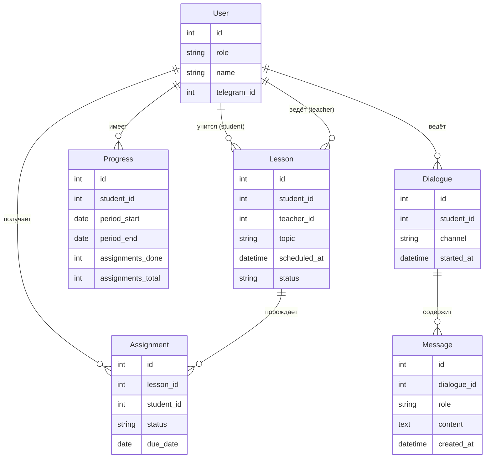

# Модель данных

Базовый перечень сущностей системы сопровождения учебного процесса. Детали схемы и миграции — на этапе реализации backend.

---

## Основные сущности

### User (Пользователь)
Единая запись для всех ролей в системе.

| Поле | Тип | Описание |
|---|---|---|
| id | UUID / int | Первичный ключ |
| role | enum | `student` · `teacher` |
| name | string | Имя пользователя |
| telegram_id | int (nullable) | Привязка к Telegram-аккаунту |
| created_at | datetime | Дата регистрации |

---

### Lesson (Занятие)
Конкретная учебная сессия между преподавателем и учеником.

| Поле | Тип | Описание |
|---|---|---|
| id | UUID / int | Первичный ключ |
| student_id | → User | Ученик |
| teacher_id | → User | Преподаватель |
| topic | string | Тема занятия |
| scheduled_at | datetime | Запланированное время |
| status | enum | `scheduled` · `completed` · `cancelled` |
| notes | text (nullable) | Заметки по итогам занятия |

---

### Assignment (Домашнее задание)
Задание, выданное по итогам занятия или отдельно.

| Поле | Тип | Описание |
|---|---|---|
| id | UUID / int | Первичный ключ |
| lesson_id | → Lesson (nullable) | Привязка к занятию (если есть) |
| student_id | → User | Кому выдано |
| description | text | Формулировка задания |
| due_date | date | Срок сдачи |
| status | enum | `pending` · `submitted` · `overdue` |

---

### Progress (Прогресс)
Агрегированная оценка выполнения домашних заданий и посещаемости ученика за период.

| Поле | Тип | Описание |
|---|---|---|
| id | UUID / int | Первичный ключ |
| student_id | → User | Ученик |
| period_start | date | Начало периода |
| period_end | date | Конец периода |
| lessons_completed | int | Занятий пройдено |
| assignments_done | int | ДЗ выполнено |
| assignments_total | int | ДЗ всего |
| summary | text (nullable) | Комментарий преподавателя |

---

### Dialogue (Диалог)
История переписки ученика с LLM-ассистентом.

| Поле | Тип | Описание |
|---|---|---|
| id | UUID / int | Первичный ключ |
| student_id | → User | Ученик |
| channel | enum | `telegram` · `web` |
| started_at | datetime | Начало диалога |

---

### Message (Сообщение в диалоге)
Отдельное сообщение внутри диалога.

| Поле | Тип | Описание |
|---|---|---|
| id | UUID / int | Первичный ключ |
| dialogue_id | → Dialogue | Диалог |
| role | enum | `user` · `assistant` |
| content | text | Текст сообщения |
| created_at | datetime | Время отправки |

---

## Связи между сущностями

---

## Выбор СУБД

### MVP — PostgreSQL

Рекомендуется с самого начала, даже если нагрузка небольшая.

**Почему не SQLite:**
- Система многокомпонентная (bot + backend + web) — несколько процессов, SQLite не подходит для конкурентной записи.
- При деплое на VPS или в контейнерах SQLite добавляет проблемы с доступом к файлу.

**Почему PostgreSQL:**
- Полноценная реляционная модель с поддержкой enum, JSON, datetime с таймзонами.
- Легко поднимается локально через Docker (`docker compose up db`).
- Стандарт для Python-стека (aiogram, FastAPI, SQLAlchemy / asyncpg).
- Один инстанс обслуживает все сервисы.
- Не нужно мигрировать потом — сразу правильный выбор.

### Развитие

| Потребность | Решение |
|---|---|
| Кеш напоминаний, сессии | Redis (опционально, при росте) |
| Поиск по материалам / FAQ | PostgreSQL full-text search → pgvector при появлении RAG |
| Очереди задач (напоминания, рассылки) | PostgreSQL + Celery / ARQ, или Redis Streams |

Менять СУБД не потребуется — PostgreSQL закрывает все задачи обозримого горизонта.
