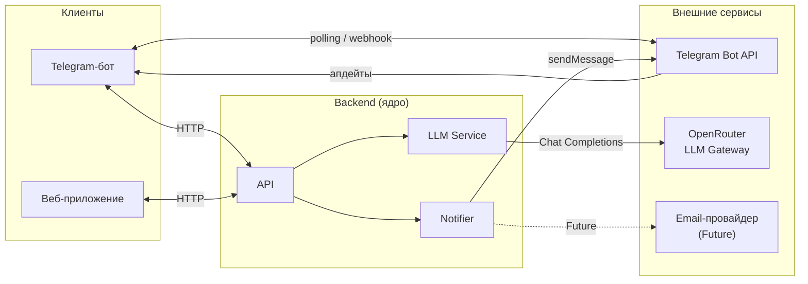

# Внешние интеграции

Документ описывает внешние системы, с которыми взаимодействует backend. Клиенты (бот, веб) не интегрируются с внешними сервисами напрямую.

---

## Внешние системы

### Telegram Bot API

| | |
|---|---|
| **Сервис** | [api.telegram.org](https://core.telegram.org/bots/api) |
| **Назначение** | Получение сообщений от учеников, отправка ответов и напоминаний |
| **Направление** | Bidirectional (polling / webhook → входящие; HTTP POST → исходящие) |
| **Протокол** | HTTPS REST; на старте — long polling, при необходимости webhook |
| **Критичность** | **MVP** — без этого нет первого клиента |

---

### OpenRouter (LLM Gateway)

| | |
|---|---|
| **Сервис** | [openrouter.ai](https://openrouter.ai) |
| **Назначение** | Генерация ответов ассистента, объяснение тем, диалог с учеником |
| **Направление** | Out (backend → OpenRouter → модель) |
| **Протокол** | HTTPS REST, OpenAI-compatible Chat Completions API |
| **Критичность** | **MVP** — диалог с ассистентом — ключевая функция |

OpenRouter используется как прокси: позволяет менять модель (GPT-4o, Claude, Mistral и др.) через единый ключ и `LLM_MODEL` в конфиге — без смены кода.

---

### SMTP / Email-провайдер

| | |
|---|---|
| **Сервис** | TBD (например SendGrid, Mailgun или собственный SMTP) |
| **Назначение** | Уведомления преподавателю, восстановление доступа в веб-приложении |
| **Направление** | Out |
| **Протокол** | SMTP или HTTP API провайдера |
| **Критичность** | **Future** — актуально при добавлении веб-аутентификации |

---

## Схема взаимодействий

---

## Зависимости и риски

| Интеграция | Риск | Митигация |
|---|---|---|
| **Telegram Bot API** | Блокировка в регионах, downtime Telegram | Backend реализует универсальный API — при блокировке Telegram достаточно подключить альтернативный клиент (веб, другой мессенджер) без изменения ядра |
| **OpenRouter / LLM** | Latency, лимиты токенов, изменение тарифов | Таймаут + fallback-ответ пользователю; модель — из конфига, легко менять |
| **OpenRouter / LLM** | Утечка персональных данных в промпт | Не отправлять чувствительные данные; минимальный контекст в запросе |
| **Email (Future)** | Зависимость от внешнего провайдера | Выбирать с надёжным SLA; не блокировать основной поток при ошибке |

**Главное правило:** сбой внешней интеграции не должен роняеть весь сервис. Каждая внешняя точка — с таймаутом, обработкой ошибки и коротким сообщением пользователю.
