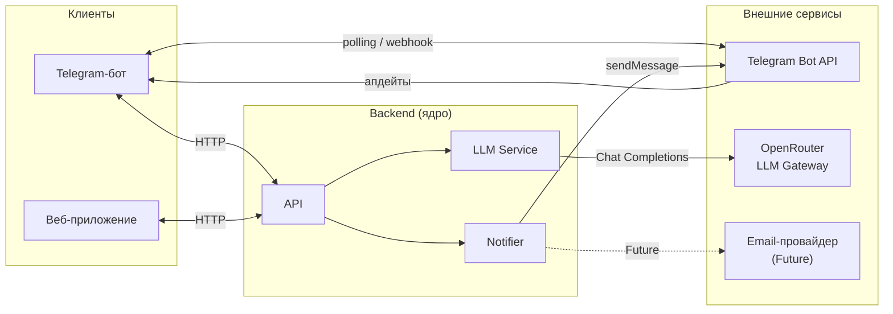

# Внешние интеграции

Документ описывает внешние системы, с которыми взаимодействует backend. Клиенты (бот, веб) не интегрируются с внешними сервисами напрямую.

---

## Backend HTTP API

Публичное HTTP API ядра: клиенты (Telegram-бот, веб) обращаются только сюда. Префикс версии, формат ошибок и HTTP-коды — [api-conventions.md](api-conventions.md). У запущенного backend интерактивная схема: **Swagger UI** `GET /docs`; выгрузка JSON: `make openapi-export` → [openapi.json](openapi.json) в корне `docs/`.

### CRUD и прогресс (MVP)

| Метод | Путь | Назначение |
|-------|------|------------|
| `POST` | `/v1/users` | Создать пользователя |
| `GET` | `/v1/users/{user_id}` | Получить пользователя |
| `GET` | `/v1/users/{user_id}/progress` | Сводка прогресса ученика |
| `POST` | `/v1/lessons` | Создать занятие |
| `GET` | `/v1/lessons/{lesson_id}` | Получить занятие |
| `PATCH` | `/v1/lessons/{lesson_id}/status` | Обновить статус занятия |
| `POST` | `/v1/assignments` | Создать домашнее задание |
| `GET` | `/v1/assignments/{assignment_id}` | Получить ДЗ |
| `PATCH` | `/v1/assignments/{assignment_id}/status` | Обновить статус ДЗ |

При создании пользователя можно передать опционально `class_label`, `phone`, `email`; при создании занятия — опционально `duration_minutes` (иначе 60). См. `GET /docs`.

Проверка готовности: `GET /health` (вне префикса `/v1`).

#### Регистрация пользователя перед smoke-тестом

Бот возвращает `Профиль не найден` если `telegram_id` отправителя отсутствует в БД. Перед тестом зарегистрируйте себя (узнать свой `telegram_id` можно через [@userinfobot](https://t.me/userinfobot)). Преподаватель может задать или изменить **Telegram ID** ученика в веб-интерфейсе (`POST/PUT /v1/students`, см. [api-contracts.md](tech/api-contracts.md)).

**curl (bash/WSL):**
```bash
curl -s -X POST http://localhost:8000/v1/users \
  -H "Content-Type: application/json" \
  -d '{"telegram_id": <ваш_telegram_id>, "name": "Test User", "role": "student", "class_label": "10А", "phone": "+79001234567", "email": "student@example.com"}' | python -m json.tool
```

**PowerShell:**
```powershell
Invoke-RestMethod -Method Post -Uri http://localhost:8000/v1/users `
  -ContentType "application/json" `
  -Body '{"telegram_id": <ваш_telegram_id>, "name": "Test User", "role": "student", "class_label": "10А"}'
```

Успешный ответ — объект пользователя с `id` (UUID). После этого бот принимает сообщения.

### Диалог с ассистентом

| Метод | Путь | Назначение |
|-------|------|------------|
| `POST` | `/v1/dialogue/message` | Принять текст ученика, сохранить сообщения в диалоге, вернуть ответ ассистента |

**Тело запроса (JSON):** `telegram_id` (integer), `text` (string), опционально `dialogue_id` (UUID string) — продолжить существующий диалог.

**Успех `200`:** `dialogue_id`, `message_id` (сообщение ассистента), `text`, `created_at`.

**Ошибки:** см. [api-conventions.md](api-conventions.md); типичные коды — `422` (валидация), `404` (пользователь/диалог не найдены), `503` (LLM недоступен).

Полный контракт — [tech/api-contracts.md](tech/api-contracts.md). План задачи с историей решений — [task-04](tasks/impl/backend/tasks/task-04-api-dialogue-contract/plan.md).

---

## Внешние системы

### Telegram Bot API

| | |
|---|---|
| **Сервис** | [api.telegram.org](https://core.telegram.org/bots/api) |
| **Назначение** | Получение сообщений от учеников, отправка ответов и напоминаний |
| **Направление** | Bidirectional (polling / webhook → входящие; HTTP POST → исходящие) |
| **Протокол** | HTTPS REST; на старте — long polling, при необходимости webhook |
| **Критичность** | **MVP** — без этого нет первого клиента |

---

### OpenRouter (LLM Gateway)

| | |
|---|---|
| **Сервис** | [openrouter.ai](https://openrouter.ai) |
| **Назначение** | Генерация ответов ассистента, объяснение тем, диалог с учеником |
| **Направление** | Out (backend → OpenRouter → модель) |
| **Протокол** | HTTPS REST, OpenAI-compatible Chat Completions API |
| **Критичность** | **MVP** — диалог с ассистентом — ключевая функция |

OpenRouter используется как прокси: позволяет менять модель (GPT-4o, Claude, Mistral и др.) через единый ключ и `LLM_MODEL` в конфиге — без смены кода.

---

### SMTP / Email-провайдер

| | |
|---|---|
| **Сервис** | TBD (например SendGrid, Mailgun или собственный SMTP) |
| **Назначение** | Уведомления преподавателю, восстановление доступа в веб-приложении |
| **Направление** | Out |
| **Протокол** | SMTP или HTTP API провайдера |
| **Критичность** | **Future** — актуально при добавлении веб-аутентификации |

---

## Схема взаимодействий



---

## Зависимости и риски

| Интеграция | Риск | Митигация |
|---|---|---|
| **Telegram Bot API** | Блокировка в регионах, downtime Telegram | Backend реализует универсальный API — при блокировке Telegram достаточно подключить альтернативный клиент (веб, другой мессенджер) без изменения ядра |
| **OpenRouter / LLM** | Latency, лимиты токенов, изменение тарифов | Таймаут + fallback-ответ пользователю; модель — из конфига, легко менять |
| **OpenRouter / LLM** | Утечка персональных данных в промпт | Не отправлять чувствительные данные; минимальный контекст в запросе |
| **Email (Future)** | Зависимость от внешнего провайдера | Выбирать с надёжным SLA; не блокировать основной поток при ошибке |

**Главное правило:** сбой внешней интеграции не должен роняеть весь сервис. Каждая внешняя точка — с таймаутом, обработкой ошибки и коротким сообщением пользователю.
