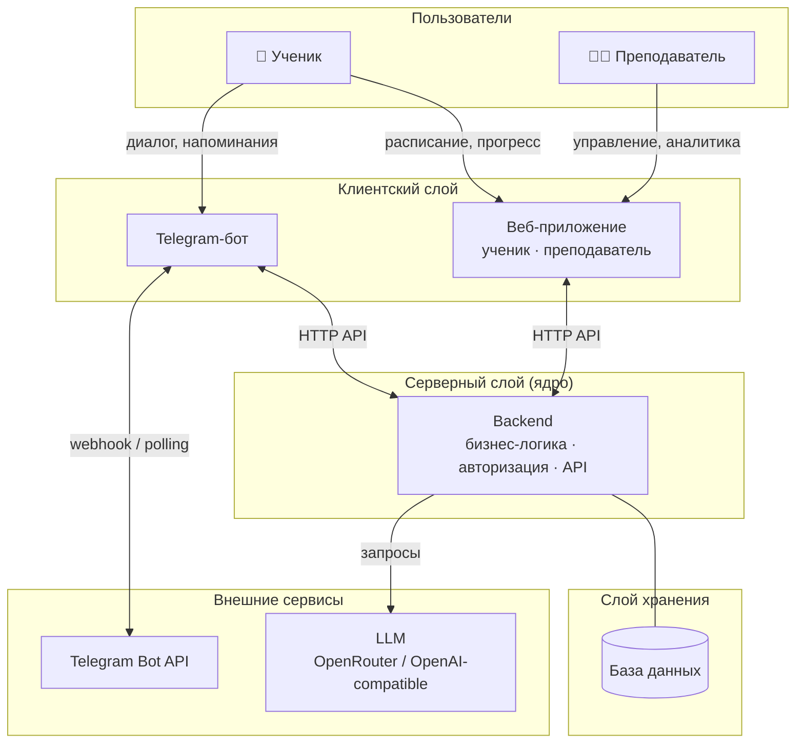

# Техническое видение

Документ описывает целевое устройство **системы сопровождения учебного процесса**: границы, архитектуру, технологический стек и принципы. Продуктовая основа — [idea.md](idea.md).

---

## Границы системы

**Система — не Telegram-бот.** Telegram-бот — первый клиент, через который ученик начинает взаимодействовать с системой. Это удобная точка входа, но бизнес-логика и данные — не внутри бота.

Система состоит из трёх частей:

| Компонент | Тип | Назначение |
|---|---|---|
| **Telegram-бот** | Клиент | Основной интерфейс ученика на первом этапе |
| **Веб-приложение** | Клиент | Единый фронтенд для ученика и преподавателя |
| **Backend** | Ядро | Централизованная логика, данные, интеграции |

Оба клиента работают через единый backend. Логика сопровождения — расписание, домашние задания, прогресс, LLM — живёт в backend, а не в клиентах.

---

## Архитектура (high-level)



**Принципы:**
- Backend — единственное место хранения логики и данных. Клиенты тонкие.
- Смена или добавление клиента (например мобильное приложение) — не затрагивает ядро.
- LLM подключается только через backend; клиенты не обращаются к нему напрямую.

---

## Компоненты

### Telegram-бот (клиент)
- Принимает апдейты, парсит команды и свободный текст.
- Вызывает backend-сервисы, отображает ответы.
- Отправляет напоминания ученику (триггер — из backend).
- Стек: **Python 3.12+**, **aiogram**, **long polling** (на первом этапе).

### Веб-приложение (клиент)
- Единый фронтенд с разделением ролей: **ученик** и **преподаватель**.
- Ученик: расписание, статус ДЗ, история занятий, диалог с ассистентом.
- Преподаватель: управление расписанием, материалами, ДЗ; просмотр прогресса учеников.
- Стек: определяется отдельно при старте фронтенд-компонента.

### Backend (ядро)
- Обрабатывает запросы от обоих клиентов.
- Содержит логику расписания, напоминаний, фиксации результатов, формирования контекста для LLM.
- Авторизация и ролевая модель — здесь.
- Стек: Python 3.12+, **FastAPI** (или аналог), **pydantic-settings** для конфига.

### Слой данных
- Реляционная БД (ориентир: SQLite → PostgreSQL при росте).
- Персистентность для всех доменных сущностей (см. раздел ниже).
- Детали схемы — в `docs/data-model.md` (создаётся отдельно).

### LLM-компонент
- Внешний сервис через OpenAI-compatible API (провайдер: **OpenRouter**).
- Единая точка вызова в backend: модель и URL — из конфигурации.
- Формирование промпта: системная роль + контекст ученика из БД + вопрос.
- Детали интеграции — в `docs/integrations.md`.

---

## Роли и пользовательские сценарии

### Ученик
| Сценарий | Канал |
|---|---|
| Узнать дату, тему, что принести на следующее занятие | Бот, Веб |
| Получить напоминание о занятии и о ДЗ | Бот |
| Подтвердить занятие / запросить изменение расписания | Бот |
| Спросить, как решить задачу или объяснить тему | Бот, Веб |
| Узнать, что задано домой и статус сдачи | Бот, Веб |
| Посмотреть историю занятий и свой прогресс | Веб |

### Преподаватель
| Сценарий | Канал |
|---|---|
| Управлять расписанием занятий | Веб |
| Назначать и редактировать домашние задания | Веб |
| Отмечать прохождение занятий и фиксировать результат | Веб |
| Смотреть статус ДЗ и активность по ученикам | Веб |
| Вести базу материалов, тем, FAQ | Веб |

---

## Доменные сущности

> Детализация и связи — в `docs/data-model.md`.

| Сущность | Описание |
|---|---|
| **Преподаватель** | Пользователь с ролью учителя; управляет содержанием |
| **Ученик** | Пользователь с ролью ученика; привязан к Telegram |
| **Тема** | Единица учебного содержания (модуль курса) |
| **Занятие** | Конкретная сессия: дата, тема, статус, что принести |
| **Материал** | Файл, ссылка или текст, прикреплённый к теме/занятию |
| **Домашнее задание** | Задание с дедлайном и статусом выполнения |
| **Контрольная работа** | Проверочное задание с результатом |
| **Результат** | Факт выполнения/оценка по ДЗ или контрольной |
| **Статус прогресса** | Агрегированная картина по ученику за период |
| **FAQ / Knowledge item** | База знаний для LLM-контекста по курсу |

---

## Внешние связи

> Детализация — в `docs/integrations.md`.

| Интеграция | Назначение |
|---|---|
| **Telegram Bot API** | Получение апдейтов, отправка сообщений и напоминаний |
| **OpenRouter / LLM API** | Генерация ответов, объяснений, диалог с учеником |

---

## Технологии

| Область | Выбор |
|---|---|
| Язык | Python 3.12+ |
| Зависимости | **uv** — `uv sync` / `uv add`; lock-файл по политике uv |
| Telegram-клиент | **aiogram**, long polling → webhook по мере роста |
| Backend-фреймворк | **FastAPI** (или аналог) — фиксируется при старте backend |
| LLM-клиент | OpenAI-compatible SDK (`openai`) с `base_url` на OpenRouter |
| Конфиг и секреты | **pydantic-settings** + `.env` локально; `.env.example` в репо |
| Автоматизация | **GNU Make**: `install`, `run`; при необходимости `lint`, `format` |
| БД (старт) | SQLite → PostgreSQL при росте |

---

## Структура репозитория

Ориентир для multi-component проекта:

```text
.
├── Makefile
├── pyproject.toml          # корневой проект или workspace uv
├── README.md
├── docs/
│   ├── idea.md
│   ├── vision.md
│   ├── data-model.md       # доменная модель, связи сущностей
│   └── integrations.md     # детали внешних интеграций
├── bot/                    # Telegram-бот (клиент)
│   └── src/ttlg_bot/
│       ├── handlers/
│       ├── services/       # вызовы backend API
│       └── config.py
├── backend/                # ядро системы
│   └── src/ttlg_backend/
│       ├── api/            # маршруты
│       ├── services/       # бизнес-логика
│       ├── storage/        # репозитории, БД
│       └── llm/            # LLM-клиент
├── frontend/                    # фронтенд-приложение (ученик + преподаватель)
└── .env.example
```

> Структура уточняется по мере роста. Компоненты могут жить в отдельных репозиториях — решение принимается при старте backend/web.

---

## Принципы разработки

- **KISS:** минимум слоёв и абстракций; усложнять по мере реальных нужд.
- **Тонкие клиенты:** бот и веб — только UI и транспорт; логика — в backend.
- **Явные зависимости:** конструкторы, простые фабрики; без тяжёлого DI.
- **Конфигурация из окружения:** секреты не в коде, не в git.
- **Один класс — один файл** (где уместно).
- Типизация и линтинг — Ruff или аналог, по согласованию в Makefile.

---

## Конфигурация и безопасность

- `TELEGRAM_BOT_TOKEN`, `OPENROUTER_API_KEY` — обязательны для бота.
- `DATABASE_URL`, `LLM_MODEL`, `OPENROUTER_BASE_URL` — для backend.
- В логах не писать токены и персональные данные.
- Ошибки API — краткое сообщение пользователю, детали в лог.

---

## Логирование

- Стандартный `logging`; уровень из конфигурации.
- Префикс с именем модуля; `exc_info` при ошибках LLM/Telegram.
- Debug-режим локально — без маскирования только явно.

---

## Сборка и запуск

1. `uv sync` (или `make install`).
2. Заполнить `.env` по `.env.example`.
3. `make run` → запускает нужный компонент (бот / backend / оба).

**Деплой:** не фиксируется на первом этапе; возможны VPS, Docker, PaaS — описать в README при появлении среды.

---

## Архитектурные решения

Значимые решения фиксируются в виде ADR (Architecture Decision Records) — с контекстом, альтернативами и обоснованием.

Журнал и принципы: [`docs/adr/README.md`](adr/README.md)

| № | Решение | Статус |
|---|---|---|
| [ADR-001](adr/adr-001-database.md) | Выбор СУБД → PostgreSQL | Принято |

---

## Версионирование документа

Документ живой. При изменении границ системы, стека или архитектурных решений — обновлять соответствующие разделы и синхронизировать с `idea.md`.
